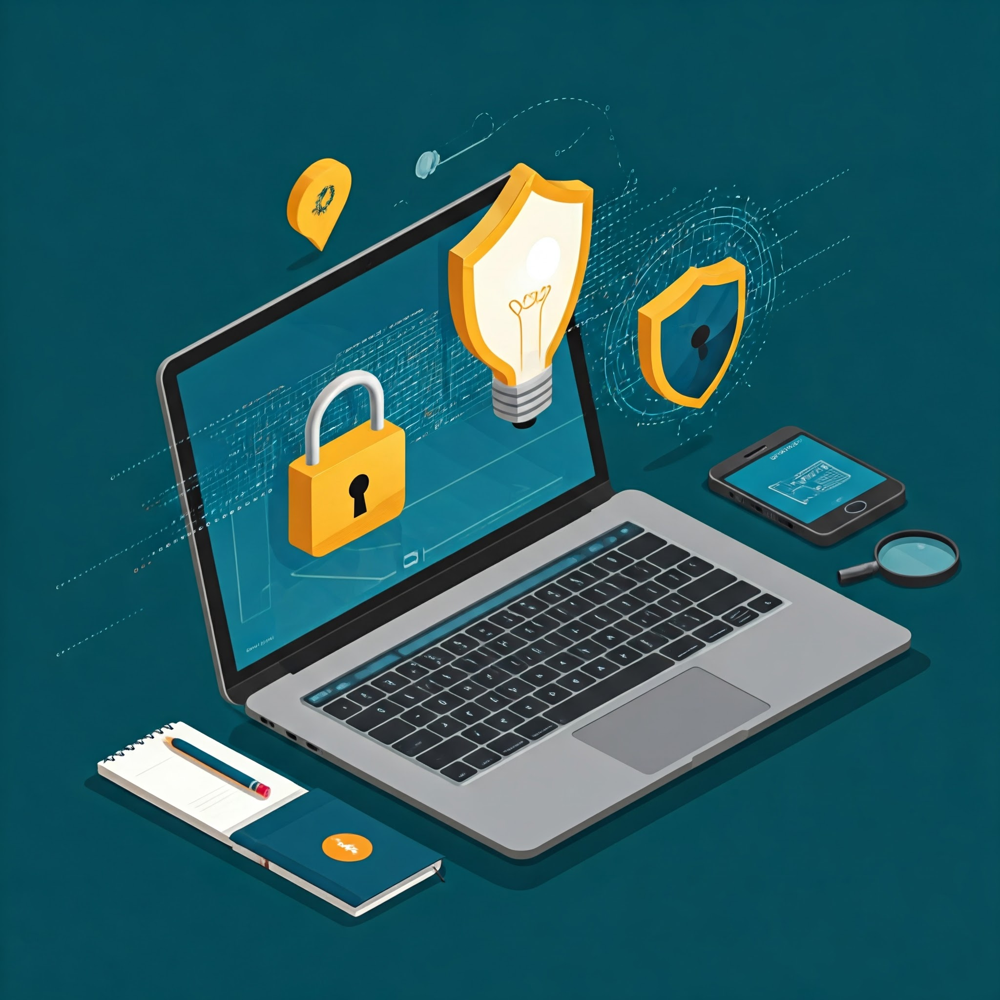

# IS-2.a..e-JaviRodriguez
# Reflexión y Resumen sobre la Unidad de Seguridad Informática

---
## 1 -  ¿Qué te han parecido los temas tratados?

Todos los temas tratados me han parecido muy interesantes ya que no tenía más información sobre qué protocolos se llevan a cabo en tema de la ciberseguridad, como se hace un análisis de riesgo y qué políticas se pueden implementar  para mantener la información del personal a salvo. Y por último hacer que las personas tomen conciencia sobre la ciberseguridad para evitar posibles filtraciones de datos.

## 2 - ¿Qué te ha parecido más útil para tu futuro puesto de trabajo en un equipo de seguridad?

Lo más importante para un puesto de trabajo es seguir las políticas que se menciona en el punto  1.3 de la unidad 1 ya que siguiendo estos puntos mantienes tus datos personales y los de otros trabajadores a salvo que para la empresa sería muy importante no filtrar información.

## 3 - ¿Conocías todos los puntos tratados en la unidad? ¿Cuáles no?

Los puntos 1.2, 1.3 y 1.4 de la unidad si lo tenía más claro porque en la empresa que estuve de prácticas  me comentaron todos los puntos a tener en cuenta.

De todos los puntos tratados no tenía mucha idea sobre el apartado 1.1 de la unidad 1.

## 4 - ¿Alguno te ha llamado especialmente la atención? ¿Por qué?

Me llamo mucho la atención el punto sobre la concienciación y formación, porque muchas personas no tienen ni idea de cómo afectan algunos actos que hacen como tener la sesión abierta del correo o tener las contraseñas en un papel para no tener que recordar la contraseña, esto parece algo normal para ello pero para otras personas pueden ser oro, lo que conlleva a robo de información para la empresa. Por eso es importante hacer formaciones para mantener la confidencialidad de la empresa y de los trabajadores.

## 5 - ¿Destacarías algún punto de la unidad? ¿Cuál y por qué?

Creo que en general el temario está bastante completo y bien estructurado.

## 6 - ¿Has echado en falta algún tema?
En mi opinión creo que para entender el tema 1 satisface todos los puntos de manera correcta.

# Resumen - Principios Generales
El primer tema de esta asignatura es esencial en el campo de la ciberseguridad, ya que trata tanto la prevención de ataques como la respuesta a incidentes. También enfatiza la importancia de proteger los sistemas a partir de la tríada CIA (Confidencialidad, Integridad y Disponibilidad). Estos principios son clave para asegurar que la información sea accesible únicamente para quienes deben tenerla, se mantenga intacta y esté disponible cuando se requiera. Este enfoque establece una base sólida para entender y aplicar medidas efectivas de ciberseguridad.

## Algunas definiciones y casos prácticos.

### ¿Qué es la ciberseguridad?
Para entender qué es la ciberseguridad imagina que es como poner candados alarmas y un sistema de vigilancia en tu casa pero en este caso está enfocado a sistemas informáticos. En el mundo de hoy en día los SmartPhones, ordenadores y redes contienen información con nuestra información y si no está bien protegido puede conllevar a pérdidas de datos o introducir cualquier tipo de virus.

**Caso práctico:** Por ejemplo cuando creas un correo electrónico en gmail puedes usar contraseñas fuertes y usar un autenticación por móvil (MFA) para proteger la cuenta. Esto hace que le añades como una capa adicional para que solo tu puedes acceder a tu cuenta, y no otra personas con intenciones maliciosas.

### ¿Qué es la respuesta de los incidentes?
La respuesta a incidentes se refiere a las acciones que se toman cuando ocurre un problema en el sistema, como un hackeo o un ataque. Primero, identificamos el problema, luego intentas detenerlo y minimizar el daño. Después, eliminas la amenaza y restauras el funcionamiento normal. Finalmente, evalúas lo sucedido para prevenir que vuelva a ocurrir. Todo este proceso es crucial para reducir el impacto y garantizar que el sistema continúe operando.

**Caso práctico:** Por ejemplo, cuando una empresa se da cuenta de que su base de datos ha sido hackeada y que los datos de los clientes están en riesgo. De inmediato, el equipo de IT informa sobre el incidente, explicando cómo ocurrió el ataque y bloqueando el acceso a los sistemas afectados. Luego, la empresa lleva a cabo un análisis del ataque que resultó en el robo de datos para prevenir futuros incidentes.

### ¿Qué es la Tríada (CIA)?
La triada es un pilar muy importante en el mundo de la ciberseguridad porque a partir de este concepto se puede construir cualquier estrategia de protección de datos:

- **Confidencialidad:** Solo las personas autorizadas pueden acceder a la información.
- **Integridad:** La información debe mantenerse exacta y completa, sin modificaciones no autorizadas.
- **Disponibilidad:** La información y los sistemas deben estar disponibles cuando se necesiten.

**Caso práctico:** En una organización que maneja datos sensibles, como un hospital, la protección de la información es crucial para garantizar la privacidad, la exactitud y el acceso continuo a los registros.
- **Confidencialidad:** Una empresa de salud protege los registros médicos de los pacientes utilizando cifrado y limitando el acceso solo al personal autorizado. Esto garantiza que únicamente médicos y enfermeras con credenciales específicas puedan acceder a los datos.
- **Integridad:** Para prevenir modificaciones no autorizadas en los registros médicos, se implementan sistemas de auditoría y firmas digitales, que permiten detectar cualquier cambio en la información.
- **Disponibilidad:** Los sistemas de gestión de datos están diseñados para estar disponibles las 24 horas, con copias de seguridad regulares y sistemas redundantes que aseguran el acceso a la información en todo momento.
